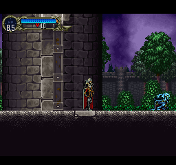
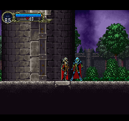

# SotN Recomp Multiplayer

An experimental [SymphonyRecomp](https://github.com/BlackLabelHQ/SymphonyRecomp) mod project for adding cooperative multiplayer to Castlevania: Symphony of the Night.

## Project Status

Version `0.4.0` is an experimental, bounded same-room local co-op proxy. It is still a feasibility probe, not complete co-op. Player 1 remains the one native Alucard entity; Player 2 is mod-managed and shares Player 1's room and camera.

The implemented work is divided into six workstreams:

1. **Managed animation and body:** an immutable 43-pose map covering idle, walk, jump rise, fall, landing, crouch enter/hold/exit, standing hurt, compact crouched hurt, attack startup/active/recovery, and downed states. Each pose binds a validated native visual frame to managed timing and a managed hurtbox.
2. **Persistent static-terrain movement:** dense floor, ceiling, wall, and hull sensors; standing and crouched stances; crouch-to-stand clearance; one-way floors; four-update coyote time and landing jump buffering; validated standing/crouched X/Y reconstruction after ordinary room transitions; and bounded tether recovery beside Player 1.
3. **Profile-aware outgoing combat:** Circle creates one equipment-derived contact window; Up+Circle creates one bounded managed straight projectile. Both reuse at most one exact-owned native attack/effect entity in slot `17..47` and let the normal engine perform target collision, damage, death, and reward handling.
4. **Managed incoming combat:** 100 HP, contact damage, 60-update hit invulnerability, 18-update hurt lock, knockback, downed state, and a cooperative revive.
5. **Enemy diagnostics and CEN awareness:** a read-only stage-slot target scan reports candidate/nearest-target data and combat evidence. Only normal Center Cube (`CEN`) distance/side helper return values may experimentally choose a closer, stable Player 2.
6. **Combat presentation:** a deterministic direct-GP0 projectile marker and fixed-screen Player 2 HP/downed/revive/profile HUD render after the avatar without persistent primitives or textures.

The outgoing path deliberately allocates one transient native attack/effect entity. It does **not** allocate a second player entity, spoof or mutate Player 1, call `DealDamage`, or directly write target HP/dead/reward state. Native target damage/death/reward semantics remain active during normal collision, so shared native rewards or progression may change when Player 2 kills an enemy. Incoming damage and enemy diagnostics are read-only with respect to native entities and apply only to managed Player 2 state.

This release has no networking and does not provide a second complete native Alucard context, full equipment combat, independent rooms, or complete game-wide co-op behavior.

## Screenshots

| Independent locomotion | Managed crouch | Player 2 jump |
| --- | --- | --- |
|  |  |  |

## Compatibility

The build targets the US SymphonyRecomp `v0.4.3b` release. It validates collision, the equipment-profile implementation (`GetEquipProperties` at `0x800FE728`), pure attack calculation (`CalcAttack` at `0x800F4D38`), attacker-ID, damage, and enemy-definition addresses plus runtime sprite-table entries, and otherwise fails closed. Experimental awareness is deliberately limited to generated `cen` helper symbols and normal `Stage.CenterCube`.

Use a legally owned US PlayStation copy of Castlevania: Symphony of the Night. Other regions, modified executables, Richter mode, and the prologue are unsupported.

## Pose Mapping

The map below contains all 43 immutable pose entries, in pose-index order. **US native frame** selects validated visual/body sprite data from the game's frame, descriptor, and sprite tables. **Updates** is the mod's managed animation timing; it is not a claim about native Alucard animation timing. Hurtboxes are managed `(offset X, offset Y, half-width, half-height)` values relative to Player 2; the X offset mirrors with facing.

| Pose | Managed state and frame | US native frame | Updates | Managed hurtbox |
| ---: | --- | ---: | ---: | --- |
| 0 | `Idle 0` | `0x7A` | 12 | `(0, 1, 4, 20)` |
| 1 | `Idle 1` | `0x7B` | 12 | `(0, 1, 4, 20)` |
| 2 | `Idle 2` | `0x7A` | 12 | `(0, 1, 4, 20)` |
| 3 | `Idle 3` | `0x7B` | 12 | `(0, 1, 4, 20)` |
| 4 | `Walk 0` | `0x19` | 4 | `(0, 1, 4, 20)` |
| 5 | `Walk 1` | `0x1B` | 4 | `(0, 1, 4, 20)` |
| 6 | `Walk 2` | `0x1D` | 4 | `(2, 3, 5, 13)` |
| 7 | `Walk 3` | `0x1F` | 4 | `(5, -1, 8, 9)` |
| 8 | `Walk 4` | `0x21` | 4 | `(5, -1, 8, 9)` |
| 9 | `Walk 5` | `0x23` | 4 | `(5, -1, 8, 9)` |
| 10 | `Walk 6` | `0x25` | 4 | `(2, 3, 5, 13)` |
| 11 | `Walk 7` | `0x27` | 4 | `(2, 3, 5, 13)` |
| 12 | `JumpRise 0` | `0x65` | 6 | `(5, -5, 6, 12)` |
| 13 | `JumpRise 1` | `0x66` | 6 | `(5, -5, 6, 12)` |
| 14 | `Fall 0` | `0x6E` | 6 | `(0, -3, 4, 16)` |
| 15 | `Fall 1` | `0x6F` | 6 | `(0, -3, 4, 16)` |
| 16 | `Landing 0` | `0x74` | 5 | `(2, 3, 5, 13)` |
| 17 | `Landing 1` | `0x75` | 5 | `(2, 3, 5, 13)` |
| 18 | `Landing 2` | `0x76` | 5 | `(0, 7, 4, 16)` |
| 19 | `Landing 3` | `0x77` | 5 | `(0, 1, 4, 20)` |
| 20 | `Landing 4` | `0x78` | 5 | `(0, 1, 4, 20)` |
| 21 | `CrouchEnter 0` | `0x02` | 2 | `(0, 7, 4, 16)` |
| 22 | `CrouchEnter 1` | `0x03` | 4 | `(0, 13, 4, 9)` |
| 23 | `CrouchEnter 2` | `0x04` | 4 | `(0, 13, 4, 9)` |
| 24 | `CrouchEnter 3` | `0x05` | 4 | `(0, 13, 4, 9)` |
| 25 | `CrouchEnter 4` | `0x06` | 4 | `(0, 13, 4, 9)` |
| 26 | `CrouchEnter 5` | `0x07` | 4 | `(0, 13, 4, 9)` |
| 27 | `CrouchEnter 6` | `0x08` | 4 | `(0, 13, 4, 9)` |
| 28 | `CrouchEnter 7` | `0x09` | 4 | `(0, 13, 4, 9)` |
| 29 | `CrouchEnter 8` | `0x0A` | 4 | `(0, 13, 4, 9)` |
| 30 | `CrouchEnter 9` | `0x0B` | 4 | `(0, 13, 4, 9)` |
| 31 | `CrouchEnter 10` | `0x0C` | 4 | `(0, 13, 4, 9)` |
| 32 | `CrouchEnter 11` | `0x0D` | 4 | `(0, 13, 4, 9)` |
| 33 | `CrouchEnter 12` | `0x0E` | 4 | `(0, 13, 4, 9)` |
| 34 | `CrouchHold 0` | `0x0F` | 255 | `(0, 13, 4, 9)` |
| 35 | `CrouchExit 0` | `0x11` | 3 | `(0, 7, 4, 16)` |
| 36 | `CrouchExit 1` | `0x12` | 3 | `(0, 1, 4, 20)` |
| 37 | `Hurt 0` | `0x9F` | 18 | `(0, -3, 4, 16)` |
| 38 | `AttackStartup 0` | `0x7A` | 8 | `(0, 1, 4, 20)` |
| 39 | `AttackActive 0` | `0x7A` | 4 | `(0, 1, 4, 20)` |
| 40 | `AttackRecovery 0` | `0x7A` | 10 | `(0, 1, 4, 20)` |
| 41 | `Downed 0` | `0x9F` | 255 | `(0, -3, 4, 16)` |
| 42 | `CompactHurt 0` | `0x9F` | 18 | `(0, 13, 4, 9)` |

Durations of 255 are long looping/held managed poses. Landing, crouch entry/exit, and the attack phases are managed one-shots; terminal one-shot poses are held rather than modulo-looped.

## Movement and Reconstruction

- Horizontal movement advances in at most one-pixel substeps. Standing side checks use seven vertical sensors (`24, 17, 9, 1, -7, -14, -21`); crouched checks use five (`24, 17, 9, 5, 1`).
- Vertical floor and ceiling movement uses three horizontal sensors at `-6, 0, 6`, as does grounded refresh. Standing-clearance reconstruction uses a dense 7-by-3 hull; crouched clearance uses a 5-by-3 hull.
- Down enters crouch only while grounded. Releasing Down checks the full standing hull; Player 2 remains crouched and reports stand-blocked if there is not enough clearance.
- Reconstruction waits for three safe updates, tests X offsets `±24, ±32, ±40, ±48` and Y offsets `0, -8, 8, -16, 16`, and validates both standing and crouched hulls plus floor support. It suspends rather than placing Player 2 into an unvalidated candidate. After a nonfatal unsupported-terrain or no-safe-candidate failure, the magenta Suspended phase remains stable for 30 safe updates: updates 1 through 29 suppress all probes and update 30 permits exactly one retry. A failed retry rearms the same cooldown. Success, room/layer/player reload, diagnostic reset, and unload clear the active latch; collision-disabled and fatal replace it with terminal suspension.
- The deterministic tether policy warns at `160 x 112`, resists outward movement at `224 x 160`, and starts hard reconstruction only when separation is strictly greater than the existing `256 x 192` bound. Resistance blocks only a horizontal command that increases separation; inward recovery remains available. It never moves Player 1 or the camera.
- Collision supports dense static tile checks and one-way floors. Any shaped/slope effect bit (`0xF800`) suspends the collision frame and starts reconstruction rather than pretending that sloped traversal is correct.

This does not implement traversal on slopes, moving platforms/elevators, water or quicksand behavior, inverted gravity, or stage-specific scripted terrain.

Jump forgiveness and stance policy now run through separate allocation-free managed machines. Jump continuations are bound to one machine and a nonwrapping revision, preserving the exact four-update coyote/buffer ordering while rejecting stale, duplicate, or cross-machine completion. Standing-hull results use the same capability model, so a collision-query fault cannot commit a guessed stance. Native input sampling, collision queries, velocity, native sprite/frame/hurtbox resolution, rendering, and downstream diagnostics remain adapter responsibilities.

`ManagedLocomotionReducer` owns logical locomotion/animation selection, the exact 43-pose timing catalog, frame/tick progression, one-shots, loops, transition evidence, and attack-phase countdown boundaries. `ManagedMovementSessionReducer` owns safe-update stabilization, room and transition phase, reconstruction authorization/results, manual reset, tether/collision recovery, post-transition movement acceptance, fatal/unload state, counters, and snapshot eligibility.

Reconstruction candidate order is also explicit managed policy: each Y offset contains ascending distance pairs with positive X first, and standing precedes crouched at every coordinate. Runtime and tests share one allocation-free orchestration seam. Blocked candidates continue, collision faults stop immediately, and exhaustion reports no safe candidate. Success uses prepared checked coordinates, stance/jump/locomotion capabilities, pose and health projections, session completion, and diagnostics; every fallible step finishes before cross-token validation and one nonthrowing authoritative commit.

### Managed Replay Identity

Successful Player 2 simulation updates now capture one immutable processed-input frame and one movement-only proxy snapshot. Their identity uses a monotonic managed update ID plus a session-local room epoch; unlike the existing attack room hash, the epoch advances across transitions and repeated visits to the same room. Diagnostic resets preserve identity, reconcile same-room versus changed-room observations, and cannot reset the managed update sequence.

The M4 replay/test schema v2 writes 116 canonical bytes in a fixed order with explicit little-endian integers, `0/1` booleans, bounded enum values, the ASCII `coop-managed-state` domain, and schema byte `2`. Movement-session phase is stored at offset 57 with stable wire values `1..9`; zero and unknown values fail closed. The current fixture FNV-1a 64-bit golden is `bb05d22920f8b29f`. The live hash path writes to a bounded stack span and allocates no per-update byte array. This movement-only snapshot is test/replay evidence, not a network packet, correction snapshot, persistence format, or reconnect keyframe.

## Profile-Aware Outgoing Combat

Circle (`O`) and Up+Circle (`I+O`) share the existing safe 8-update startup, 4-update active pose, and 10-update recovery. At active entry, the mod chooses a stable equipped hand (left when nonempty, otherwise right), validates item range `0..168`, copies the immutable US equipment definition, and calls only the deterministic `CalcAttack` routine when required. It deliberately does **not** call `GetEquipProperties`, because that routine consumes native RNG and recomputes global Player 1 statistics. A bounded guest-stack region is saved, cleared, restored byte-for-byte, and verified. A stack-backed guard restores and verifies all 32 guest registers plus seven exposed special-register words after direct dispatch. The one GTE-dependent item `0x8D`, empty/non-damaging profiles, unsupported pointers, invalid items, or malformed hit-state tuples cancel that attack before publication.

The immutable latched tuple supplies attack, element, enemy invincibility frames, stun frames, native hit state, hit effect, deterministic definition-source field, and item identity. Randomized `GetEquipProperties` output is intentionally not reproduced. The managed profiles are:

| Input | Geometry and lifetime |
| --- | --- |
| Circle | One normal-engine contact window at facing offset `±14,-8`, half-size `12x10`. |
| Up+Circle | One straight facing projectile, half-size `5x5`, speed 4 px/update, maximum 40 windows and 160 px. It is removed on first native hit, timeout/range/screen failure, unsafe lifecycle, transition, or room mismatch. |

There is never more than one projectile or outgoing entity. A projectile keeps one exact-owned slot and native `EntityNull` update while its managed world position advances before each next collision window. Each window deactivates publication fields while mutating, revalidates room/ownership/timing, clears prior hit evidence, captures bounded compatible targets, then publishes entity ID/update/hit state last. It does not pierce.

Allocation keeps the v0.3 quarantine model: marker `0x50324B43`, generation, and room hash at `+0x7C/+0x80/+0x84`; exact ownership before cleanup; valid attacker ID `0..10`; and mutation stop on ambiguous reuse. Normal collision alone may mutate targets and run death/reward behavior. The mod never calls `DealDamage` and never writes target HP, dead flags, or rewards. Compatible breakables remain eligible through centralized target bits `hitboxState & 0x3E`, rather than a hard-coded bit-2 test.

Attack safety is split across testable lease and publication boundaries. `AttackLeaseMachine` owns `Empty`, `Owned`, retryable `CleanupPending`, and terminal `MutationStopped`, together with tuple/owner/nonwrapping-revision authorization and reset carry. `AttackPublicationPolicy` owns ownership-before-payload ordering, live-fields-last publication, operation journaling, projectile deactivate-mutate-republish order, target observation, synchronous rollback/retry, unload classification, and residual evidence. The adapter performs actual native probes, reads, writes, direct guest dispatch, and target observations. Observed reuse permanently stops mutation; diagnostic reset refuses atomically when cleanup authority cannot be established and preserves the existing session/generation for a later retry.

## Enemy Diagnostics and Center Cube Awareness

During safe gameplay, a read-only scan of stage slots `64..191` samples active, nondead, on-screen bodies with target bits in `state & 0x3E`. `EN` reports native and current-profile-compatible candidate samples plus a bounded nearest snapshot: slot, entity ID, enemy ID, HP, and integer P1/P2 screen distances. Structured diagnostics additionally report the truthful current compatible-target count; contact/projectile automation requires exactly one while preserving the existing pre-reset `EN=P` gate. No candidates is an honest `W/EMPTY`, not failure. Existing native attack hit flags plus per-attacker cooldown increases track target hits; HP/dead observations additionally classify defeated and HP-zero/breakable-like evidence. Nothing in this diagnostic writes targets.

Only generated `GetDistanceToPlayerX_cen`, `GetDistanceToPlayerY_cen`, and `GetSideToPlayer_cen` have post-hooks. They may change only `context.V0`, and only when normal Center Cube gameplay has a stable alive Player 2 and `g_CurrentEntity` is exactly an active, targetable, nondead stage slot `64..191`. P2 is selected only when its squared screen distance plus a 64-unit margin is strictly less than P1's; ties choose P1. Every validation failure preserves native V0. Exceptions preserve V0 and disable only awareness. Menus, transitions, loading, downed P2, other stages, and unstable rooms naturally disarm it.

## Combat HUD and Visuals

The backend-independent `DrawOTag` GP0 path draws the status pip, then the safely gated avatar, a small deterministic marker for an active projectile, and a fixed-screen HUD inside the canonical 256-pixel stage. Sprite success and off-screen avatar culling do not suppress the combat HUD. It reuses the exact expected-buffer/ordering-table gates and `WriteStageDrawEnvironment`, and uses only transient GP0 tiles. It allocates no primitives or textures.

A separate minimal GP0 status pip is eligible whenever the mod is enabled and the game is showing a valid stage display. Unlike the avatar and combat HUD, it remains eligible while the frame is unsafe, the proxy is uninitialized, a transition/reconstruction is pending, or P2 is suspended. Active is cyan, warning yellow, outward resistance orange with a stop tick, reconstruction blue, suspension magenta, and downed red. Menus, loading, maps, and non-stage displays suppress it. Once any rendering exception latches fatal, pre-render capture and every later direct status/avatar/HUD GPU or render-memory call are skipped permanently until an explicit successful diagnostic reset; there is no per-frame retry loop.

## Managed Incoming Damage and Revive

The read-only contact scan examines native stage slots `64..191`. A newly damaging overlap, changed attack phase, or bounded repeat opportunity contributes managed damage; if several occur in one scan, the strongest is used. Attack values are clamped to `1..40`. A hit subtracts from Player 2's 100 managed HP, applies 60 updates of invulnerability, 18 updates of hurt lock, and knockback away from the contact (`±2.5` horizontal and `-3.5` vertical pixels/update initially). A crouched hit uses the compact hurt pose. Zero HP enters downed state.

To revive, keep Player 1 within 24 horizontal and 32 vertical pixels, hold **Player 1 Down + Player 2 Circle** continuously for 120 safe updates, and keep both players compatible, controlled, alive/same-room as required by the probe. Player 1 liveness uses Alucard's positive native HP, non-dead status, and non-death control step; it does not require the generic slot-0 entity update pointer, which is legitimately zero in this runtime. Revive returns Player 2 at 50 HP with 120 updates of post-revive invulnerability. Releasing a button or violating a condition cancels progress. Revive proximity does **not** raycast wall occlusion yet.

The scan never calls native Player 1 damage and never writes an incoming entity. Protected Player 1 runtime/status, castle flags/map, and save-workspace regions are fingerprinted before and after every scan.

An allocation-free contact opportunity machine owns the 128-slot historical policy after those reads pass their guard: eligibility-driven incarnation generations, exact identity and phase changes, initial baseline, suspension/resume grace, 60-scan repeats, entry/stay/exit counters, and deterministic strongest-hit arbitration. Every simultaneous opportunity is consumed, damage is compared after clamping to 40, and equal damage retains the lower native slot. The adapter still owns scanning, geometry, fingerprints, managed-health application, knockback, animation, and attack cancellation.

Managed health policy is now isolated in a pure state reducer with explicit fixed rules: 100 maximum HP, damage clamped to 40, 60-update hit protection, 18-update hurt lock, 120-update revive, recovery to 50 HP, and 120-update revive protection. Contact scanning still selects the native observation and the runtime adapter still performs knockback and attack cancellation; the reducer owns opportunity consumption, suppression, damage/downing, timers, revive progress/cancellation/recovery, reconstruction protection, counters, and invariant projection. Checked counter overflow fails closed instead of silently wrapping.

Revive eligibility crosses the runtime boundary as one immutable observation containing processed P1/P2 buttons, signed distance, P1 alive/compatibility state, control availability, and room stability. Inclusive `24 x 32` distance semantics are tested independently without moving native memory reads into the pure model.

## Installation

1. Open SymphonyRecomp's `mods` directory.
2. Clone this repository as `coop`:

   ```bash
   git clone https://github.com/mojomast/sotnrecompmultiplayer.git coop
   ```

3. Start SymphonyRecomp and enable **Co-op Feasibility Probe** in the mods menu.
4. Configure **Pad 2** in SymphonyRecomp's input settings only when testing a physical controller.
5. Load an Alucard save in a normal castle room.

SymphonyRecomp compiles the C# files under `source/` at runtime. After `git pull`, restart or reload the mod and confirm `Co-op Feasibility Probe v0.4.0` appears in its settings panel.

**Use virtual Player 2 keyboard** defaults to enabled when no setting exists. Explicitly toggling that checkbox persists only `mods.coop-feasibility.virtualPlayer2Keyboard` through the public runtime view configuration, so configured Pad 2 mode survives a cold launch. No diagnostic, input, lifecycle, or automation state is persisted. To restore the safe default, check the box again (preferred), or remove that one key from the runtime view configuration while the game is stopped; a missing key loads as `true`.

## Test Procedure

Use only this diagnostic mod for the first test when possible. The virtual controls are `I/J/K/L = Up/Left/Down/Right`, `U = Cross/jump`, `O = Circle/attack`, and `P = Start` on Pad 2.

1. Leave **Use virtual Player 2 keyboard** enabled unless testing configured controller 2. Load an ordinary room with flat floor, low clearance, walls, a ceiling, a ledge, an ordinary transition, and enemies if possible.
2. Open settings, click **Reset diagnostic**, close the entire Mods window, and release all virtual keys for at least two frames. Optionally run the bounded automatic Right/Left/Cross movement test first.
3. Test idle, walking in both directions, rise/fall, landing, coyote jump, and landing-buffered jump. Verify animation and facing follow Player 2.
4. Hold Pad 2 Down (`K`) to crouch. Test a low ceiling: release Down and verify Player 2 remains crouched while stand-blocked, then move/reconstruct into clearance and verify the standing transition.
5. Exercise the 43 mapped poses where practical. `D` requires all animation states/hurtbox states and all 43 hurtbox poses; `VIS` requires all 43 visual poses. A crouched hit is required for `CompactHurt`; a completed attack supplies all three attack phases; reaching zero HP supplies `Downed`.
6. Test dense static terrain against floors, walls, ceilings, one-way platforms, narrow edges, and both stances. Do not interpret suspension at a shaped/slope tile as slope support.
7. Equip a normal damaging hand item. Tap Pad 2 Circle (`O`) near an ordinary enemy, then use Up+Circle (`I+O`) from farther away. Verify the contact attack has one window, only one projectile exists, its marker moves straight, and it disappears on hit/range/timeout/transition. Confirm `X` reports the latched item tuple, extraction/restore checks, exact cleanup, valid attacker ID, and hit-flag plus target-cooldown evidence. Native rewards may change.
8. Let an ordinary damaging enemy/hazard body hit Player 2. Verify HP decreases, knockback/hurt occurs, and immediate repeated contact is suppressed during hit invulnerability. Take a hit while crouched to exercise compact hurt.
9. Reduce Player 2 to zero HP and verify downed behavior. Start a revive and deliberately release a button once to record a cancellation. Then place Player 1 within the inclusive `24 x 32` range and hold **Player 1 Down + Player 2 Circle** for 120 uninterrupted safe updates. Verify recovery at `50/100` HP. Walls do not block revive proximity yet.
10. Cross an ordinary room boundary with Player 1. After the room stabilizes, verify Player 2 reconstructs at a validated standing or crouched X/Y candidate, then move Player 2 at least eight commanded pixels so `T` can pass.
11. Separate P2 through the `160 x 112` warning boundary, then approach `224 x 160`; verify outward input is resisted while inward input still works. A setup that begins strictly beyond `256 x 192` must produce one latched hard reconstruction rather than repeated unchecked teleports.
12. Test contact entry, stay, exit, positive attack contact, and magenta tint; check **I saw the Player 2 contact tint** only after seeing it. Spend at least ten seconds in quiet and enemy rooms. Verify `EN=...EMPTY` remains `W`, then records nearest slot/IDs/HP/P1-P2 distances and hit/defeat/HP-zero evidence when targets exist.
13. In normal Center Cube only, approach an ordinary target from opposite sides with P1 and P2. Verify `AW` overrides only while P2 is strictly closer by the margin, ties retain P1, and leaving CEN/menu/transition/downed state disarms awareness without affecting other systems.
14. Verify the fixed P2 HUD remains visible when the avatar is off screen and when the textured sprite succeeds. Check HP fill, downed tint, revive fill, contact/projectile profile indicator, and moving projectile marker. Also verify the status pip colors/shapes while warning, resisting, reconstructing, suspended, and downed; it must remain visible when ordinary avatar mutation is gated. `HU` should show matching combat-HUD eligible/submitted counts; tether status has separate structured metrics.
15. Exercise all seven Pad 2 controls. In physical mode, optionally require and sweep all four analog axes. Check **I can see the Player 2 avatar** only for the independently animated textured avatar, not fallback geometry.
16. Reopen settings, inspect failures/status, click **Copy report**, and send the single `P2D4 ...` line plus any first-error, collision, contact, visual, reconstruction, attack, enemy, awareness, HUD, or health diagnostics.

The complete `HP=P` predicate intentionally requires at least one damage event, one hit-invulnerability suppression, one downing, one revive start, one revive cancellation, and one successful verified revive, ending alive at exactly 50 HP.

## `P2D4` Report Fields

Version `0.4.0` uses the `P2D4` schema. `VER` and `VIS` are deliberately distinct, resolving the old duplicate `V` key. Values below are **illustrative, not captured proof**:

```text
P2D4 VER=0.4.0 ... VIS=P:... X=P:CLEAN:WINDOW/.../P1,42,18,20,2/E2,0,2,0/J8,8 EN=P:S500/N1400/C900/T72,31,7,24,80,36,1/H2,1,0/LTARGET AW=P:C220/O90/S72/LP2:72 HU=P:E640/S640 HP=P:50/100/...
```

| Field | Exact layout and meaning |
| --- | --- |
| `VER` | Unique semantic version key; `0.4.0` for this schema. |
| `H` | Result and `VSync/RunMainEngine/UpdatePlayerEntities/RenderEntities/Pad2Read` callback counts. `P` requires each count ≥60; fatal is `F`, otherwise `W`. |
| `I` | Input result and source. Virtual: `K:-/pad/game/tap/A-`; physical: `C:host/pad/game/tap/Aaxes`. Virtual `P` requires all seven key-downs, key-ups, pad, game, and tap observations, a neutral observation, and zero current virtual output. Physical `P` requires connection and all seven at all four stages, plus four active axes when requested. Otherwise `W`. |
| `K` | Virtual `down/up/Hcurrent-output/Rraw-held/Uraw-seen/Nneutral-observed/SUI-suppression`; `-` in physical mode. |
| `M` | Result and commanded left pixels/right pixels/jump-rise observation. `P` requires ≥8 pixels each way and a measured ≥4-pixel rise. |
| `R` | Result and submitted/eligible render callbacks, user visual confirmation, `DrawOTag` count, and HLE active/ready bits. `P` requires confirmation and ≥60 submitted frames. |
| `N` | Native body-source gate: result and confirmed/captured/eligible/opposite-facing/fallback counts, `/S` consecutive confirmation streak, `/F` opposite facing in that streak, and `/L` latest status. `P` requires confirmation, ≥60 confirmed submissions, streak ≥60, opposite facing in the streak, and `OK`. It gates safe post-stage drawing; Player 2 does not replay or splice this GT4. |
| `B` | Contact result: `/F` scans, `/S` slots scanned, `/E` eligible samples, `/O` overlaps, `/C` current, `/P` peak, `/D` damaging samples, `/I` entries, `/T` stays, `/X` exits, `/R` resets, `/U` resume-grace scans/budget/suspended, `/G` guard checks/failures, `/V` tint confirmation, `/H` current hurtbox, `/Q` differing guard region, `/L` status. `P` requires ≥120 scans, exactly 128 slots and one guard check per scan, entry/stay/exit, a damaging sample, tint confirmation, and no disable/guard failure. Disable or guard failure is `F`. |
| `C` | Collision result and calls/restore failures/rejected corrections/unsupported-terrain suspensions/ground contacts/wall corrections/ceiling corrections, then `/B` solid/empty bits. `P` requires ≥120 calls, zero restore failures, zero unsupported suspensions, solid and empty observations, and at least one ground/wall/ceiling contact. Fatal, collision disable, or restore failure is `F`. |
| `T` | Transition result and passed/completed/layer-event counts, `/R` reconstruction stable updates/attempts/successes/failures, `H` tether recoveries, and `/L` status. `P` requires at least one completed transition, passed=completed, and no pending transition or awaited post-transition movement. Fatal, collision disable, or a current hard no-safe-candidate reconstruction failure is `F`. |
| `S` | Attack/effect pool minimum free slots/minimum longest free run/sample count. Before five samples it is `W`; zero minimum free is `F`; `P` requires ≥4 free and a run ≥2, otherwise `W`. |
| `G` | Safety code plus `E` mod enabled, `S` current safe frame, and `P` proxy initialized bits. This is a state code, not a `P/W/F` predicate. |
| `Q` | Diagnostic generation/proxy-reset requests/completed resets/reset-pending bit. |
| `A` | Automatic-test state (`I` idle, `Q` queued, `R` running, `P` completed, `X` cancelled), sequence frame, and completed runs. |
| `E` | `0` none; `X` caught fatal exception; `Axxxxxxxx` collision API mismatch; `Cvalue` rejected correction; `Qslot` quarantined attack; `ATK` other attack hard failure; `HPn` health invariant failures; `G` contact guard mismatch; `M` unsupported contact memory; `V` independent visual disabled; `EQ` equipment scratch restoration failure; `AW` awareness-local failure. |
| `D` | Managed animation result: locomotion/animation/frame/tick, `/S` animation-state mask, `/F` advanced-state mask, `/Q` completed attack-phase mask, `/P` hurtbox-state mask, `/T` transitions, `/A` frame advances, `/H` hurtbox samples and current shape, `/C` crouched/stand-blocked bits. Locomotion is `0..7` = Idle, Walk, Rising, Falling, Crouched, Attacking, Hurt, Downed. Animation is `0..13` = Idle, Walk, JumpRise, Fall, Landing, CrouchEnter, CrouchHold, CrouchExit, Hurt, CompactHurt, AttackStartup, AttackActive, AttackRecovery, Downed. `P` requires all 14 state and hurtbox-state bits, advance bits for Idle/Walk/JumpRise/Fall/Landing/CrouchEnter/CrouchExit, all 43 hurtbox-pose bits, ≥4 transitions, ≥120 hurtbox samples, and attack phase mask `7`. Fatal is `F`. |
| `VIS` | Independent visual result: current native frame, `/P` 43-bit visual-pose mask, `/H` 43-bit hurtbox-pose mask, `/E` eligible, `/S` submitted, `/R` restore checks/failures, `/X` visual failures, `/L` status. `P` requires user confirmation, the complete visual-pose mask, ≥120 submissions, ≥1 restore check, and `OK`; the hurtbox mask is reported but enforced by `D`. Fatal, visual disable, or restore failure is `F`. |
| `J` | Jump result: `/N` normal, `/C` coyote, `/B` buffered counts, `/R` remaining coyote/buffer windows. `P` requires at least one coyote and one buffered jump. |
| `X` | Outgoing attack result: status, `/T` timer, `/O` owned slot/cleanup-pending, `/Q` exact quarantine tuple, `/A` allocations, `/W` validated normal-engine windows, `/C` cleanups/lifecycle cancellations, `/F` failures/timing failures, `/I` attacker ID/valid, `/G` timing generations, `/R` causal/hit/cooldown/HP-change evidence, `/P` kind/item/attack/element/hit-state, `/E` extraction failures and scratch restore checks/failures, `/J` projectile windows/lifetime. `P` requires a cleaned allocation, valid windows/attacker ID, causal evidence, and no quarantine, hard failure, count error, or restore failure. Multiple projectile windows per one allocation are valid. |
| `EN` | Enemy diagnostic result: `/S` safe scans, `/N` native target-body samples, `/C` cumulative current-profile-compatible samples, `/T` nearest slot/entity ID/enemy ID/HP/P1 distance/P2 distance/current-compatible bit, `/H` native target hits/defeats/compatible HP-zero hits, `/L` status. `P` requires the current nearest target to be compatible. No native candidates is `W` (`EMPTY`), never `F`; fatal is `F`. |
| `AW` | Center Cube awareness result: helper calls, `/O` V0 overrides, `/S` currently chosen slot, `/L` status. At least one override is `P`, no evidence is `W`, subsystem exception/disable is `F`. |
| `HU` | Combat HUD result and eligible/submitted draws. `P` requires ≥60 eligible draws with every eligible draw submitted; fatal is `F`. |
| `HP` | Managed health result: HP/max, `/I` invulnerability, `/K` hurt lock, `/D` applied events/opportunities consumed/invulnerability suppressions/hit-invulnerability suppressions/last damage/slot/element, `/N` downed bit/count, `/R` progress/starts/cancels/revives/verified recoveries, `/F` invariant failures. `P` requires damage, hit-invulnerability suppression, downing, revive start and cancellation, ≥1 revive, recoveries=revives, final alive state at exactly 50 HP, and no invariant failure. Fatal or invariant failure is `F`. |

Unless specified otherwise, `P` means pass, `W` means incomplete/waiting (or a nonfatal capacity warning), and `F` means a latched failure. A `P2D4` line is diagnostic evidence, not proof of universal game compatibility.

### Structured Diagnostic Contract

Production reports now pass through a bounded `P2D4Report` parser and canonical formatter before they are displayed, copied, printed, or captured. The parser requires the exact 23 unique keys, legal result states, printable ASCII, canonical bounded decimal values for validated fields, and selected cross-field safety invariants. Parent scenario and campaign consumers share one independent strict 64 KiB `p2d4/2` parser that requires exact root identity/frame fields, the complete legacy field set, and the exact closed metric names and scalar types; partial fake envelopes, duplicates, unknowns, and missing metrics fail closed. Retry diagnostics expose `reconstructionRetryCooldown`, `reconstructionRetries`, `reconstructionSuppressedAttempts`, and stable `reconstructionSuspensionReasonCode`. Attack diagnostics expose `attackExactOwnedLifetimeCurrent` and `attackExactOwnedLifetimeMaximum`; every native window with the exact retained marker/lease increments a nonwrapping counter, cleanup clears current while preserving maximum, and successful diagnostic reset clears both. It deliberately accepts valid failure evidence such as a guard check that fails before a scan commits or cleanup after a failed pre-allocation publication.

The co-op provider captures a JSON `p2d4/2` envelope containing the mod version, a per-load 32-hex session ID, diagnostic generation from `Q`, latest mod VSync frame, caller-supplied automation frame, the unchanged canonical legacy line and exact legacy `fields` object, plus one closed flat `metrics` object. Metrics are JSON integers, booleans, or printable ASCII strings only. They cover room epoch, transition/reconstruction pending current/maximum duration and post-move abandonment/failure, tether phase/reason/entries/frame totals/maxima/outward resistance/status submissions/hard recoveries, health/damage/revive, attack lifecycle and kind-specific evidence, enemy outcomes, restoration, exact-owned marker census, fatal/error state, and Pad 2 availability. Tether phase values `1..5` mean Active, Warning, Resistance, Reconstructing, Suspended; reason values `0..10` mean none, comfort, resistance, hard, transition, reconstruction, lifecycle, unsupported terrain, collision, fatal, downed. Diagnostic reset clears this release evidence. Legacy reports remain bounded to 16 KiB and final structured responses to 64 KiB.

The attack marker census reads only slots `17..47` and never mutates a slot. Publication, rollback, cleanup, quarantine cleanup, cancellation, and unload refresh the count synchronously in the same update; ordinary bounded scans cross-check it. A marker is current only when its slot/generation/room tuple exactly matches the owned or retained-quarantine lease; any other marker is reported as an orphan and fails outgoing combat closed.

The 60-minute campaign enforces the cumulative exact-owned maximum, not merely sampled marker duration. Its exact bound is 48 native windows: the supported projectile lifecycle is at most 40 windows and cleanup receives eight grace windows. A maximum of 49 fails even if allocation and cleanup both occurred between observer polls. The sampled 48-frame stuck-marker check remains an independent fallback. At or after exactly 3600 seconds, the observer explicitly captures and validates minute 60 unless already captured, requires exactly 13 total samples, and persists the final manifest before publishing `Passed`.

The NO0 drop observer scans only pool slots `160..191` around normal engine windows. It recognizes exact prize ID 3/update `0x801C9220`, equipment ID 10/update `0x801C9C34`, and the native same-slot ID 10 to ID 3 initialization morph. One spawn is associated only when one exact P2-owned attack has hit plus cooldown evidence, exactly one compatible target is defeated in that window, and exactly one matching new drop appears in the same room within 24 pixels without ambiguity. Attack-target capture stores 16 records; a seventeenth compatible target marks the window truncated, increments explicit attack-target and drop ambiguity/overflow metrics, and forbids unique defeat/drop association. Breakables, ambient/simultaneous spawns, multiple causal defeats, wrong updates/rooms/positions, and pending-window exhaustion never become P2 associations. Fixed arrays and four bounded pending defeats avoid per-update allocations. Collection is generic only when pickup-step/hit evidence and a matching native reward delta both exist; without safe inventory proof, diagnostics never claim equipment collection. Native EXP is currently unavailable under a validated read contract, so it is reported only if a future read-only adapter supplies it and is never called guaranteed P2 reward attribution.

Automation protocol `1.2` exposes these operations through `sotn_get_mod_diagnostics` and `sotn_reset_mod_diagnostics` and adds an atomic one-or-two-port input batch for scenario v2. RecompOne discovers the exact public convention methods after successful load, drops its delegates before unload, and serializes capture/reset through the runtime main-thread queue. The bridge validates the JSON object, reset identity, and final response bound independently. Reset requires confirmation and returns whether it applied; unresolved native attack cleanup or any reducer/generation exhaustion refuses before diagnostic mutation. Capture again after success to obtain the new generation. Console or log scraping is not the supported integration plan.

### Canonical Automation Scenario

The parent MCP assembly supports exact `sotn-scenario/1` without changing its reset-before/ordered-input semantics and adds `sotn-scenario/2`. V2 has closed typed `p2d4/2` metric predicates, area/room telemetry predicates, explicit `before` or `none` diagnostic reset policy, and atomic multi-port steps. The canonical catalog scenario is now `coop-locomotion-jump` version `2`. After loading an ordinary supported room as Alucard and enabling mod `coop-feasibility`, run exactly one confirmed catalog command:

```text
sotn_run_scenario {"id":"coop-locomotion-jump","confirm":true}
```

The start preconditions are Play, Alucard, loading/menu/map false, active co-op hooks through `H=P`, exact `p2d4/2` diagnostics, scalar `errorCode="0"`, `fatal=false`, and `K=-`. `H=P` is used because a separate player-control telemetry field can be unavailable in valid Play states. `K=-` deliberately requires Pad 2/native-controller mode; virtual Player 2 keyboard mode fails closed rather than mixing keyboard and MCP Pad 2 input.

The catalog defines equal 72-frame atomic timelines with an eight-frame neutral recovery lead. Port 0 stays neutral; Port 1 then sends Right 12, neutral 4, Left 12, neutral 4, Cross 2, neutral 30. The checkpoint checks normal locomotion/jump evidence through `M=P`, configured processed Pad 2 source, fatal/error state, and exact orphan-marker count; it does not fix a stage/room or require broader coyote/buffered `J=P` evidence. The runner clears both ports in `finally`; after interruption, call `sotn_clear_input` and verify neutral telemetry.

The bounded catalog also contains setup-gated M5 probes. Game telemetry predicates use exact enum string `MarbleGallery`; `NO0` remains the overlay code in descriptions. `coop-transition-west` requires area 0 room 9/map cell `32,26`, with P1 manually placed on flat floor no more than eight walkable world pixels east of the west exit. Its equal 120-frame timelines begin neutral, use P1 Left 4, delay for reconstruction, then use P2 Left/inward 8; transition, pass, reconstruction, movement, abandonment, and failure evidence is per-run through deltas. Contact/projectile require a curated `EN=P` target and exactly one current compatible target before reset, then use neutral 8, attack 2, and bounded neutral recovery with exact per-run lifecycle checks. Damage/revive retains reset `none` and requires revive deltas while avoiding unavailable `PlayerHasControl`. `coop-drop-observe` is reset-none and requires an already observed unique native-drop association; repeated curated attempts may be needed, while a causal no-drop attempt is valid but incomplete evidence. These are honest probes, not prerecorded passes or claims that their setups are qualified.

The 2026-08-19 live smoke loaded `coop-feasibility` `v0.4.0` and began in Play/Alucard with loading/menu/map false and `K=-`, `H=P`, `E=0`. An exact diagnostic reset advanced generation `0` to `1`. The exact Port 2 sequence above, with Port 0 neutral also exercised, produced `M=P:18/18/1`, `H=P`, `E=0`, and `J=W:N1/C0/B0/R0,0` at automation frame 1912, which is the intended normal jump only. Manual inter-tool latency means this run does not establish same-frame port starts. State, diagnostics, at most 32 entities, 100 log lines, and a validated PNG were captured privately; no live bundle, image, or save was committed. Explicit clear at frame 2072 was followed by frame 2160 telemetry with both masks and remaining-frame counts zero.

The 2026-08-20 release session completed three distinct pre-liveness-fix cold process launches and the canonical scenario v2 passed on each. A fourth canonical pass after the liveness fix also passed. Configured Pad 2 mode persisted as `K=-`; none of these runs is cold-save route acceptance because the visible card position was empty. Post-fix Player 1 telemetry succeeded live at Castle Entrance with populated control, HP, level, and EXP fields. Natural Player 2 damage produced six events and one down at exactly 0 HP, with zero invariant, fatal, guard, restoration, orphan, or quarantine failures. After moving Player 1 from the unsupported stairs to safe flat terrain, manually overlapping Player 1 Down and Player 2 Circle produced `reviveStarts=1`, `revives=1`, `recoveries=1`, and Player 2 HP 50.

Castle Entrance stairs also exposed the pre-retry reconstruction churn: diagnostics alternated Suspended/Reconstructing with 206 suspension entries (maximum consecutive 1), 219 reconstruction attempts, and repeated failures. Moving Player 1 to flat terrain eventually recovered. The bounded 30-safe-update retry policy above was implemented afterward and has game-free adapter/static coverage, but has not yet been live-verified.

The background soak observer was started live and produced sample 1 of 13, then explicit cancellation finalized its private evidence with cleanup succeeded and verified; this is not a 60-minute pass. A route campaign attempted in the wrong stage failed preflight and remained Idle. The managed process later exited without a logged bridge or runtime error; retain that as a cold-run/soak risk, not proven crash attribution.

The same session reached the native file selector, but the visible memory-card position was empty and no native save was loaded. Therefore it is not cold-save, route, restart/load, or save-integrity acceptance evidence. Those gates, post-retry live verification, the route campaign, contact/projectile/drop qualification, and the playable soak remain open.

## Safety Model

- Player 1 remains the only native player entity. Player 2 movement, stance, timing, HP, hurt, downed, revive, and incoming damage are managed state; Player 1 movement/entity and native damage are not called or directly changed.
- Terrain collision uses a bounded 260-byte (`0x104`) guest-stack scratch footprint during synchronous player update. Every byte is saved and cleared; restoration and verification attempt all 260 bytes even after an individual memory fault. Direct guest dispatch is wrapped by a stack-backed 39-word context guard and allocates no snapshot. Corrections outside `-64..64`, API mismatch, and shaped/slope effects suspend or disable rather than guess.
- Persistent movement uses one-pixel substeps, dense standing/crouched sensors, clearance checks, floor support validation, and bounded reconstruction candidates. Unsafe game states, transitions, menus/maps, loading, cutscenes, invalid tilemaps, and unsupported characters suspend the proxy.
- Rendering still consumes no persistent primitive or GT4. It validates the native Player 1 body packet only as a post-stage gate, uploads one validated mapped sprite to a transient VRAM rectangle, draws one direct GP0 quad, restores the exact rectangle in `finally`, and verifies restoration every 60 submissions. Invalid tables/layout/CLUT use diagnostic geometry; a restoration verification failure trips the fatal circuit breaker because continuing after uncertain VRAM restoration is unsafe.
- Incoming contact remains read-only over stage slots `64..191`, with before/after fingerprints for protected native state. Only managed HP and motion respond.
- Outgoing combat is the sole intentional native entity mutation: exactly one free slot in `17..47` is transactionally ownership-marked. Contact publishes one window; a nonpiercing projectile reuses that exact slot across bounded windows. Each publication keeps live fields last; exact ownership is required before every mutation/cleanup.
- Attack lease commands are revision-bound and unforgeable outside the reducer. Ownership mismatch enters terminal quarantine, after which no cleanup probe or write is emitted. Adapter exceptions during cancellation are contained so fatal cleanup cannot replace the original latched failure.
- Native outgoing collision is intentionally permitted to mutate target combat state and run native death/reward/progression semantics. The mod never directly writes target HP.
- Equipment derivation copies the immutable definition and invokes only deterministic `CalcAttack`; it never consumes native RNG or recomputes Player 1 globals. Its bounded 144-byte scratch and 39-word context use the same exhaustive restoration and direct-dispatch guards as collision. Invalid tuples cancel before entity publication, while a failed restore trips the circuit breaker. Enemy diagnostics remain read-only.
- CEN awareness changes only helper `context.V0`; it never writes RAM or spoofs P1. Any exception disables only awareness. Projectile/HUD visuals are deterministic transient GP0 tiles with no native weapon-overlay replay or unvalidated sprite frames.
- Processed Pad 2 masks are sampled once per Player 2 update. In configured Pad 2 mode, the first observed non-neutral processed Port 2 mask latches source availability until input observation or lifecycle reset, allowing bounded automation timelines without claiming a native controller connection. Virtual input changes only active-low runtime port `1`, replaces rather than merges hardware Pad 2 input, and is released on unsafe states or settings UI.
- Hook exceptions trip a circuit breaker. Attack cancellation/cleanup is attempted without replacing the original error; quarantined ownership remains visible in `X` and `E`.

These checks reduce risk on the exact supported release. They do not prove behavior for modified executables, future SymphonyRecomp versions, every enemy, every hazard, or every room.

## Current Limitations

- Player 1 owns the camera, normal room transitions, menus, dialogue, and cutscenes.
- The 43-pose set is managed and intentionally bounded; it is not the full native Alucard animation state machine.
- Static terrain only: shaped/sloped terrain suspends rather than traverses; moving platforms/elevators, water, quicksand, inverted gravity, and unusual scripted rooms are unsupported.
- Contact scans native stage entities only. Primitive-only hazards and stage-specific nonstandard hazard logic are excluded.
- Enemy awareness is experimental only for three helper calls in normal Center Cube; most enemies/stages still do not target Player 2, and helper users may not consult all three values consistently.
- Outgoing combat derives a bounded tuple from one equipped hand but does not reproduce weapon-specific animations, factories, arcs, consumables, spells, subweapons, transformations, familiars, critical rolls/policies, or overlay behavior.
- Native reward/progression effects from Player 2 kills are shared but do not yet have explicit pickup, boss, duplicate-reward, or progression policy.
- Structured diagnostics now observe bounded NO0 native drop lifecycle and causal association. Live associated-drop evidence, validated native EXP reads, equipment inventory proof, broader overlays, and reward/progression policy remain blocked.
- Revive checks range and state but does not raycast wall occlusion.
- Player 1 remains the sole camera/exit/transition owner. Tether warning, outward-only resistance, hard reconstruction, and visible suspension are implemented; independent camera and broader exit behavior are excluded.
- The fixed combat HUD has no text/numeric HP, inventory/menu ownership, persistence, networking, rollback, or remote synchronization.
- A configured Player 2 keyboard mapping can make `Connected2` true without a physical second controller, and hot-plugging can change assignment.

## Version History

### 0.4.0

- Introduces unique-key `P2D4` (`VER` and `VIS`) plus enemy (`EN`), Center Cube awareness (`AW`), HUD (`HU`), and profile/projectile evidence.
- Adds bounded read-only target diagnostics over slots `64..191`, nearest-target snapshots, and hit/cooldown-based hit, defeat, and HP-zero/breakable-like evidence; empty rooms remain waiting, not failure.
- Adds CEN-only post-hooks for native X/Y distance and side helpers that can override only V0 for a strictly closer, stable alive P2 and fail subsystem-locally.
- Replaces the fixed attack constants with immutable equipment-definition plus deterministic `CalcAttack` tuples, one-window Circle contact, and one bounded nonpiercing Up+Circle projectile while retaining exact ownership/quarantine semantics without consuming native RNG.
- Adds direct-GP0 projectile presentation and a fixed P2 HP/downed/revive/profile HUD that cannot be suppressed by successful sprite rendering or avatar culling.

### 0.3.0

- Expands the immutable map from 16 to 43 poses, adding landing, crouch entry/hold/exit, standing and compact hurt, fixed attack phases, and downed mappings with managed durations and hurtboxes.
- Replaces sparse movement probes with persistent dense standing/crouched static-terrain sensors, stand-clearance checks, one-pixel substeps, validated X/Y and stance-aware reconstruction, and tether recovery. Shaped/sloped terrain now explicitly suspends.
- Adds one fixed Circle melee using exactly one ownership-marked transient native attack/effect slot in `17..47` for the bounded next normal-engine collision window, preserving native target damage/death/reward semantics.
- Adds transactional attack publication, exact marker/generation/room ownership cleanup, quarantine/reuse protection, validated attacker IDs, timing checks, and hit-flag plus target-cooldown causal diagnostics.
- Adds managed 100 HP, read-only contact damage, hit invulnerability, hurt lock, knockback, compact hurt, downed state, and a 120-safe-update cooperative revive to 50 HP.
- Introduces `P2D3`, expanding `D` and `V`, revising collision and transition diagnostics, and adding outgoing `X` and managed `HP` fields.

### 0.2.0

- Replaces Player 1 frame replay with independent, data-driven `Idle`/`Walk`/`JumpRise`/`Fall` frames resolved from validated US runtime sprite tables.
- Adds an immutable 16-pose mapping that binds each frame's duration and pose-specific hurtbox.
- Renders one textured quad directly through GP0 after the stage ordering table, exactly restores the overwritten VRAM rectangle, and periodically verifies that restoration by complete readback.
- Removes Player 2 GT4 allocation and ordering-table splicing; the completed Player 1 packet is now a read-only post-stage render gate.
- Fails closed on visual table, draw-layout, CLUT, or restore validation failures while retaining diagnostic geometry fallback.
- Adds four-update coyote time and a four-update landing jump buffer.
- Introduces the `P2D2` report schema with independent visual field `V`, jump-forgiveness field `J`, and revised native-source field `N` semantics.

### 0.1.6

- Added a deterministic mod-owned logical locomotion clock and sampled Pad 2 once per simulation update.
- Replaced copied Player 1 hurtboxes with a conservative mod-owned profile.
- Expanded collision scratch protection to the full bounded 260-byte footprint.
- Added `D` diagnostics while retaining `P2D1`; visuals still replayed Player 1.

### 0.1.5

- Added bounded read-only Player 2 contact shadowing against native stage entities and protected-state fingerprints.
- Recorded narrow-gap clipping as a limitation of sparse terrain probes.

### 0.1.4

- Replayed Alucard's completed native textured quad at Player 2 without an entity or persistent primitive.
- Added cyan tint, facing mirroring, and diagnostic geometry fallback.

### 0.1.3

- Added raw/current virtual-key masks and an automatic Right/Left/jump Pad 2 movement test.

### 0.1.2

- Polled virtual keys once per VSync and replaced the HLE-only marker with backend-independent GP0 rectangles.

### 0.1.1

- Added the `I/J/K/L`, `U`, `O`, and `P` virtual Player 2 keyboard and port-2 injection.

### 0.1.0

- Initial physical-controller feasibility probe.

## Architecture Direction

The intended first playable mode is constrained same-room co-op:

- Player 1 remains SOTN's native Alucard.
- Player 2 uses mod-owned movement, health, animation, and combat state.
- Both players initially share the loaded room, camera, castle progression, inventory, equipment effects, experience, and relics.
- Player 1 owns menus, dialogue, cutscenes, and room transitions.
- Player 2 is reconstructed beside Player 1 after transitions.
- Future online play would use host-authoritative input and state snapshots rather than rollback or deterministic lockstep.

Rollback, two complete native player contexts, split-screen, independent rooms, Richter/Maria co-op, and host migration are outside the initial scope.

## Roadmap

1. **Implemented experimentally:** Pad 2 input, independent rendering/restoration, managed poses/hurtboxes, jump forgiveness, terrain collision, room reconstruction, contact shadowing, and entity-capacity diagnostics.
2. **Implemented experimentally in bounded form:** the 43-pose persistent same-room proxy, dense static-terrain standing/crouched movement, transition reconstruction, and tether recovery.
3. **Implemented experimentally in bounded form:** managed damage, invulnerability, knockback, downed state, revive, and the initial exact-owned native collision path.
4. **Implemented experimentally in bounded form:** equipment-derived contact/projectile profiles, read-only enemy diagnostics, CEN-only helper awareness, projectile marker, and fixed combat HUD.
5. Broaden attack/hazard/awareness semantics beyond CEN and define camera, room-exit, pickup, reward, and shared-world progression policies.
6. Add a LAN transport probe, remote avatar snapshots, and host-authoritative movement.
7. Synchronize combat events, pickups, bosses, progression, and reconnect keyframes.

The M3/M4 baseline is complete. M5 is in progress with `p2d4/2`, protocol `1.2`, scenario v2, setup-gated probes, visible tether/suspension policy, public candidate route manifest `routes/no0-marble-gallery-candidate.json`, and parent-owned background observers `coop-route-25` and `coop-soak-60m`. The observers never launch, reset, reload, select saves, or drive input; humans prepare and play the session. The data-only `release/m5-release-matrix.json` records exact objectives and human approvals without claiming completion. The candidate route remains `NO0 9 -> 10 -> 5 -> 6 -> 5 -> 10 -> 9 -> 19 -> 11 -> 19 -> 9`. Three pre-liveness cold canonical passes and one post-liveness canonical pass have live evidence, but the empty visible card means the cold-save route gate is not accepted. Three played route runs, 25 consecutive transitions, contact/projectile/drop evidence, post-retry terrain evidence, mod-enabled native save, mod-disabled restart/load, and a human-played 60-minute soak remain blockers.

## Development

The implementation hooks `dra/RunMainEngine`, `dra/UpdatePlayerEntities`, `dra/RenderEntities`, `main/DrawOTag`, and three generated `cen` player-distance/side helpers; observes `VSyncEvent`, `PadReadEvent`, `PlayerLoadedEvent`, and `RoomLayerLoadEvent`; synchronously calls validated terrain-collision, deterministic attack-calculation, and attacker-ID routines; resolves immutable poses through validated US runtime sprite tables; scans native stage geometry through a read-only RAM view; transactionally publishes one bounded native attack/effect entity; and renders one direct GP0 textured avatar plus transient marker/HUD geometry after the stage ordering table.

The repository-owned validation gate compile-checks the real mod source through the runtime `ModCompiler` against the exact SymphonyRecomp `v0.4.3b` APIs and the current-tested development APIs using .NET 10. It also validates the strict manifest, source/report version agreement, exact hook set, compatibility constants, and the prohibition on direct native target damage. From a normal `mods/coop` checkout inside SymphonyRecomp, run:

```bash
bash tools/validate.sh
```

Pass `--current-root` and `--pinned-root` to use explicit source checkouts. The default pinned check materializes only public source from the local Git object databases under ignored `obj/`; CI checks out the exact revisions declared in `.github/workflows/validate.yml`. The gate does not use generated game source, a disc image, saves, or packaged game binaries. Gameplay validation still requires SymphonyRecomp and a legally owned US game copy.

The complete co-op gate currently passes 244 focused contracts, including exact-owned lifetime, bounded retry, strict route, and data-only release-matrix validators. Current and pinned validation also execute production-shared direct-dispatch/context and scratch-restoration probes; both produced 284672-byte dynamic mod assemblies. Each compatibility surface emitted the same four existing dependency warnings: two runtime debug-panel nullable warnings, one unused runtime audio field, and the wrapper `Game.cs` nullable return. Parent automation passes 149/149, the MCP Release build is warning-free, and the full host Release build retains five previously documented warnings.

The repository contains no copyrighted game assets or game image.

Do not submit AI-generated issues or pull requests to SymphonyRecomp's upstream repositories. This independent experiment is not affiliated with Black Label HQ or Konami.
